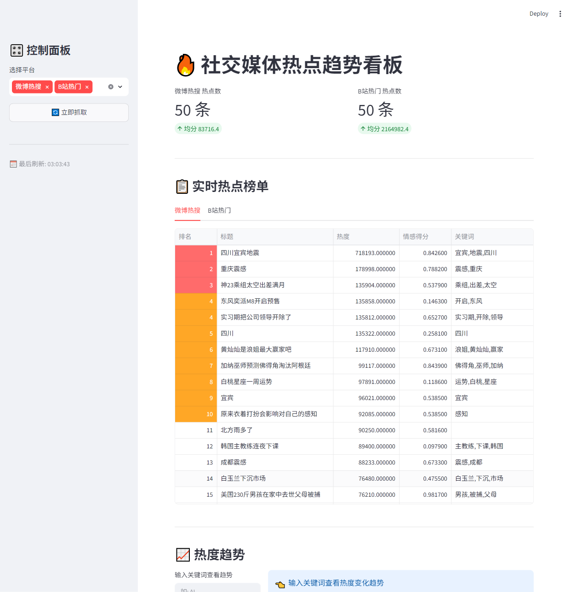

# 🔥 Web TrendRadar

> 社交媒体热点趋势看板 — 深色编辑叙事风（Editorial Data Journalism × Dark Mode）

实时追踪微博热搜、B站热门，自动情感分析 + 关键词提取，支持 Cloudflare Tunnel 公网访问。

---

## 截图



## 特性

- **🔥 多平台热点聚合** — 微博热搜 · B站热门，统一榜单查看
- **📊 情绪分布图表** — SnowNLP 情感分析，正面/中性/负面三色 Altair 柱状图
- **🔑 关键词提取** — jieba 分词，自动标注每条热点的核心话题
- **⚡ 定时自动抓取** — APScheduler 每半小时（北京时间 :00 / :30）自动刷新
- **🌐 Cloudflare Tunnel** — 一键启动公网访问，无需配置端口映射
- **🎨 深色编辑叙事风** — 金+青双色体系，Playfair Display 衬线标题，玻璃拟态卡片

## 快速开始

### 环境要求

- Python ≥ 3.13
- [uv](https://docs.astral.sh/uv/) 包管理器
- [cloudflared](https://developers.cloudflare.com/cloudflare-one/connections/connect-networks/downloads/)（可选，用于公网访问）

### 安装

```bash
git clone https://github.com/ShaLuuFPS/web-trendradar.git
cd web-trendradar
uv sync
```

### 启动

```bash
# 本地访问
uv run streamlit run main.py

# 公网访问（需先安装 cloudflared）
uv run python launch.py
```

启动后访问 `http://localhost:8501`，或使用 launcher 获取 `https://*.trycloudflare.com` 公网地址。

## 项目结构

```
trend-radar/
├── main.py                  # Streamlit 看板主程序
├── spider.py                # 爬虫模块（微博/B站/知乎）
├── db.py                    # SQLite 存储层（WAL 模式）
├── launch.py                # Cloudflare Tunnel 启动器
├── pyproject.toml           # 项目依赖
├── docs/
│   └── design.md            # 设计规范文档
└── .streamlit/
    └── config.toml          # Streamlit 深色主题配置
```

## 技术栈

| 层级 | 技术 | 说明 |
|------|------|------|
| 前端 | Streamlit · Altair · Pandas | 数据看板 + 可视化图表 |
| 爬虫 | Requests · Playwright | HTTP API + 浏览器引擎双模式 |
| NLP | SnowNLP · jieba | 情感分析 + 中文关键词提取 |
| 存储 | SQLite (WAL) | 轻量嵌入式数据库，支持并发读写 |
| 调度 | APScheduler | Cron 定时自动抓取 |
| 外网 | Cloudflare Tunnel | 零配置公网访问 |

## 设计规范

详见 [`docs/design.md`](docs/design.md) — 包含完整配色、字体、间距、组件规范。

- **风格**: 深色编辑叙事风（Editorial Data Journalism × Dark Mode）
- **主色**: Gold `#D4A056` / Cyan `#4ECDC4`
- **背景**: Page `#0F1119` / Card `#13161F`
- **字体**: Playfair Display（标题）+ Inter（正文）
- **组件**: 玻璃拟态卡片、金色轮廓线按钮、极简表格

## License

MIT
